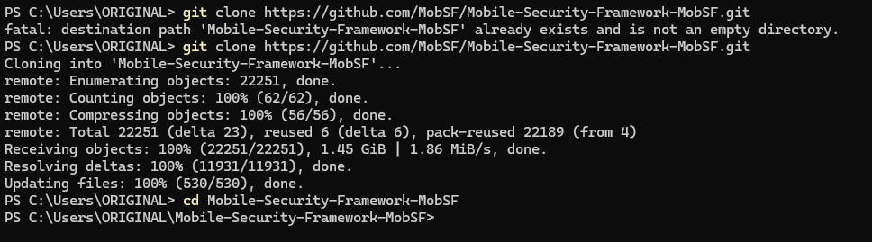
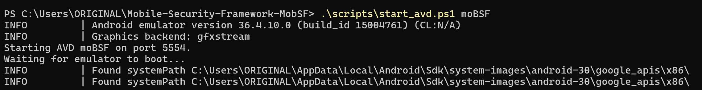
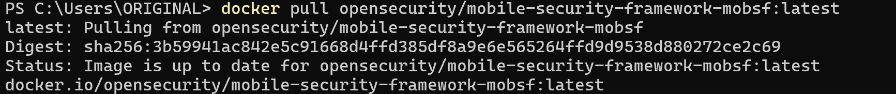
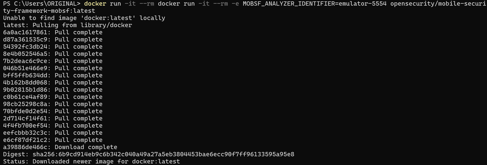
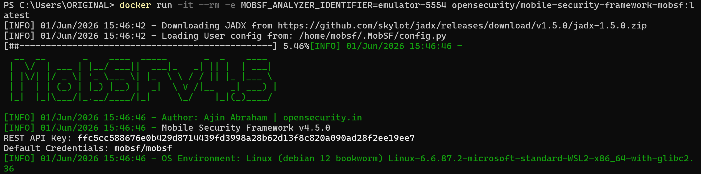
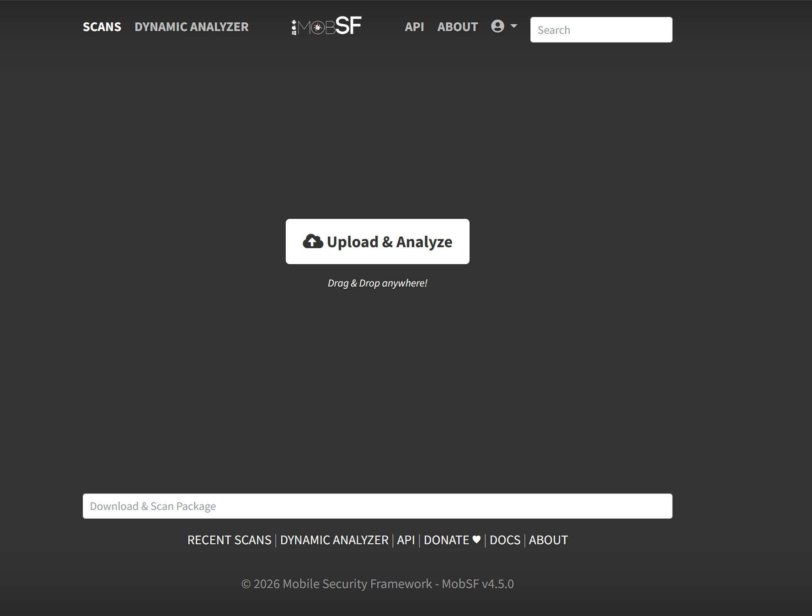
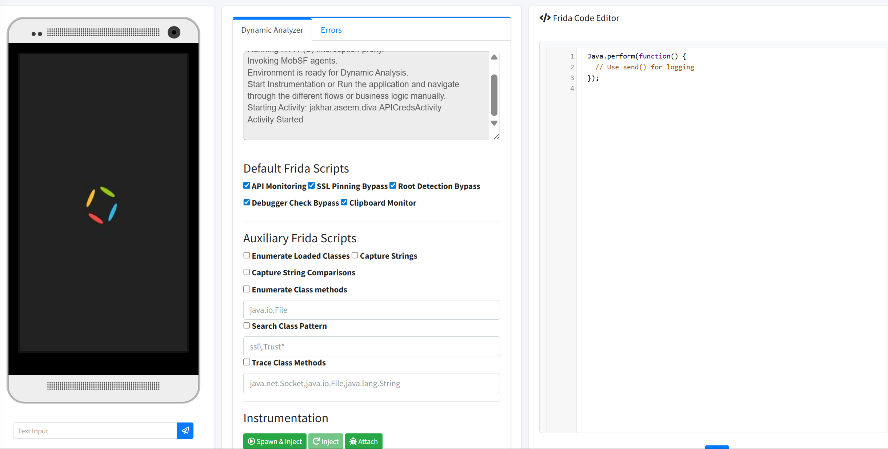

# Rapport de securite - Analyse dynamique Android avec MobSF

## 1. Objectif du lab

Ce rapport documente la mise en place et l'utilisation de **MobSF (Mobile Security Framework)** pour realiser une analyse dynamique d'une application Android. L'objectif principal est de preparer un environnement de test controle, lancer un emulateur Android, connecter MobSF a l'analyseur dynamique, puis observer l'application pendant son execution avec les scripts Frida proposes par MobSF.

L'analyse dynamique permet d'etudier le comportement reel d'une application pendant son execution : appels API, contournement SSL pinning, detection root/debugger, acces au presse-papiers, instrumentation Frida et navigation dans les activites de l'application.

## 2. Environnement utilise

| Element | Valeur observee |
| --- | --- |
| Systeme hote | Windows avec PowerShell |
| Outil principal | MobSF v4.5.0 |
| Conteneurisation | Docker |
| Emulateur Android | Android Emulator 36.4.10 |
| AVD | `moBSF` |
| Port ADB | `5554` |
| Framework d'instrumentation | Frida |
| Application analysee | Application Android lancee via MobSF, activite observee `jakhar.aseem.diva.APICredsActivity` |

## 3. Deroulement de l'analyse

### Capture 1 - Recuperation du projet MobSF



Cette capture montre la recuperation du projet **Mobile-Security-Framework-MobSF** depuis GitHub avec `git clone`. Une premiere tentative indique que le dossier existe deja et n'est pas vide, puis une nouvelle recuperation du depot est lancee correctement.

**Commentaire securite :** cette etape valide la provenance de l'outil utilise pour le lab. Pour un environnement professionnel, il est recommande de verifier la source du depot, la branche utilisee et idealement le hash du commit afin de garantir la reproductibilite de l'analyse.

### Capture 2 - Lancement de l'emulateur Android



La commande `.\scripts\start_avd.ps1 moBSF` lance l'emulateur Android associe a MobSF. La sortie confirme l'utilisation de l'emulateur Android version `36.4.10`, du backend graphique `gfxstream`, ainsi que le demarrage de l'AVD `moBSF` sur le port `5554`.

**Commentaire securite :** l'emulateur constitue la cible d'execution de l'application analysee. Le port `5554` est important, car il sert d'identifiant ADB pour connecter MobSF et ses agents a l'environnement dynamique. Un emulateur dedie au lab reduit les risques de melanger des donnees personnelles avec les donnees de test.

### Capture 3 - Verification de l'image Docker MobSF



Cette capture montre la commande `docker pull opensecurity/mobile-security-framework-mobsf:latest`. Docker indique que l'image est deja a jour, ce qui confirme que l'image MobSF officielle est disponible localement.

**Commentaire securite :** utiliser une image Docker facilite l'isolation de MobSF et rend l'installation plus simple. Cependant, le tag `latest` peut changer dans le temps. Pour un rapport reproductible, il est preferable d'utiliser une version precise ou de documenter le digest SHA256 de l'image.

### Capture 4 - Erreur de lancement Docker et correction attendue



La capture montre une tentative de lancement avec une syntaxe incorrecte : le mot `docker run` est duplique dans la commande. Docker interprete alors `docker` comme le nom d'une image et telecharge `docker:latest`, ce qui ne correspond pas a l'objectif initial.

**Commentaire securite :** cette erreur n'est pas une vulnerabilite de l'application, mais elle est importante dans le rapport car elle montre un risque operationnel. Une mauvaise commande peut lancer une image non souhaitee ou introduire un composant inutile dans l'environnement. La commande attendue doit cibler directement l'image MobSF :

```powershell
docker run -it --rm -e MOBSF_ANALYZER_IDENTIFIER=emulator-5554 opensecurity/mobile-security-framework-mobsf:latest
```

### Capture 5 - Demarrage de MobSF dans Docker



MobSF demarre correctement dans le conteneur. La sortie indique le telechargement de **JADX**, le chargement de la configuration utilisateur, puis l'affichage de la banniere MobSF. La version observee est **MobSF v4.5.0**. Les identifiants par defaut `mobsf/mobsf` sont egalement visibles, ainsi qu'une cle API REST generee par l'outil.

**Commentaire securite :** le demarrage est fonctionnel, mais deux points doivent etre signales. D'abord, les identifiants par defaut ne doivent pas etre conserves dans un environnement expose. Ensuite, la cle REST API doit etre traitee comme une information sensible, car elle peut permettre l'automatisation d'actions dans MobSF. Dans un lab local cela reste acceptable, mais en contexte reel il faut limiter l'acces reseau et changer les secrets par defaut.

### Capture 6 - Interface web MobSF



L'interface web de MobSF est accessible. Le bouton **Upload & Analyze** permet d'envoyer un APK pour analyse statique et dynamique. Le menu **Dynamic Analyzer** confirme que la plateforme est prete pour poursuivre l'analyse d'une application Android.

**Commentaire securite :** cette etape valide que le service MobSF est operationnel cote navigateur. L'upload de l'APK est le point d'entree de l'analyse : MobSF va extraire les informations de l'application, preparer l'environnement dynamique et permettre l'instrumentation pendant l'execution.

### Capture 7 - Analyse dynamique et instrumentation Frida



Cette capture montre l'interface **Dynamic Analyzer** de MobSF. L'emulateur est affiche a gauche, les journaux d'analyse sont au centre, et l'editeur de code Frida est disponible a droite. Les logs indiquent que l'environnement est pret pour l'analyse dynamique et que l'activite `jakhar.aseem.diva.APICredsActivity` a ete lancee.

Les scripts Frida par defaut sont actives :

| Script | Role dans l'analyse |
| --- | --- |
| API Monitoring | Surveille les appels API effectues par l'application |
| SSL Pinning Bypass | Tente de contourner les protections SSL pinning |
| Root Detection Bypass | Tente de contourner les controles de detection root |
| Debugger Check Bypass | Tente de contourner les controles anti-debug |
| Clipboard Monitor | Observe les interactions avec le presse-papiers |

**Commentaire securite :** cette etape est le coeur de l'analyse dynamique. L'application est executee dans un environnement controle et MobSF injecte des scripts Frida pour observer ou modifier certains comportements. Le lancement de l'activite `APICredsActivity` indique que le test se concentre probablement sur la manipulation ou l'exposition d'identifiants/API credentials. Il faut ensuite naviguer manuellement dans l'application afin de declencher les flux sensibles et collecter les traces correspondantes.

## 4. Constats principaux

| Niveau | Constat | Impact | Recommandation |
| --- | --- | --- | --- |
| Moyen | Utilisation de `latest` pour l'image Docker | Resultats moins reproductibles si l'image change | Fixer une version ou documenter le digest |
| Moyen | Identifiants MobSF par defaut visibles | Risque d'acces non autorise si MobSF est expose | Changer les identifiants et limiter l'acces local |
| Moyen | Cle REST API affichee dans la console | Risque d'abus de l'API MobSF | Ne pas partager les captures contenant des secrets |
| Faible | Erreur de syntaxe Docker observee | Telechargement d'une image non souhaitee | Verifier les commandes avant execution |
| Informatif | Environnement dynamique pret | Base valide pour tester l'application | Continuer avec navigation manuelle et collecte des logs |

## 5. Conclusion

Le lab a permis de mettre en place un environnement complet d'analyse dynamique Android avec MobSF, Docker, un emulateur Android dedie et Frida. Les captures confirment que MobSF est demarre, que l'interface web est accessible et que l'analyse dynamique peut lancer une activite de l'application cible.

L'environnement est donc pret pour poursuivre les tests de securite : surveillance des appels API, verification des communications reseau, contournement du SSL pinning, detection de controles anti-root/anti-debug et observation de donnees sensibles manipulees par l'application.

